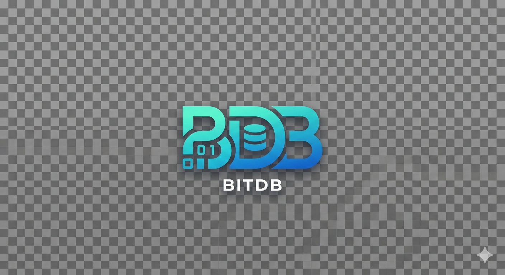

# bitdb



A modern, Redis-compatible in-memory database written in Rust — built to handle high throughput, scale horizontally, and run natively on Kubernetes from day one.

## Why bitdb?

Redis is battle-tested, but it carries two decades of design constraints. bitdb is a ground-up reimagining: same wire protocol (RESP), drop-in compatible with existing Redis clients, but engineered for the demands of modern cloud infrastructure.

- **High throughput** — non-blocking I/O with async event-driven architecture
- **Cloud-native** — designed for containers and Kubernetes from the start, not bolted on
- **Idiomatic configuration** — give it your pod's CPU and RAM limits, and it self-tunes. No manual threading, buffer sizing, or eviction math
- **Built-in bitmap primitives** — roaring bitmaps as a first-class type, not an afterthought
- **Modern persistence** — tiered AOF with compression, built for write-heavy workloads

## Current Status

bitdb is in early development. The RESP protocol is implemented and the following commands are available:

| Command | Status |
|---------|--------|
| `PING` | Done |
| `GET` / `SET` | Done |
| `INCR` | Done |
| `LPUSH` / `RPUSH` | Done |
| `LPOP` / `RPOP` | Done |
| `SELECT` | Stub |

## Roadmap

### Phase 1 — Foundation
- [ ] **Non-blocking connections** — migrate to `tokio` / `mio` epoll-based async I/O to handle massive concurrent connection counts without thread-per-connection overhead

### Phase 2 — Command Coverage
- [ ] **Core command set** — implement the most commonly used Redis commands across strings, lists, sets, sorted sets, and hashes

### Phase 3 — Native Bitmap Support
- [ ] **Roaring bitmaps** — first-class `BITMAP` type backed by the roaring bitmap data structure, exposing efficient set operations at scale

### Phase 4 — Persistence
- [ ] **Simple AOF** — append-only file persistence for crash recovery with configurable fsync policy

### Phase 5 — Advanced Persistence
- [ ] **Multi-layered AOF** — tiered write path optimized for high write throughput, with `zstd` compression to reduce I/O pressure and storage footprint

### Phase 6 — Idiomatic Configuration
- [ ] **Resource-driven tuning** — declare your container's CPU and memory limits; bitdb derives thread counts, buffer sizes, and eviction policies automatically. The only things worth configuring manually are cache eviction strategy and expiry behavior.

## Getting Started

bitdb speaks Redis' RESP protocol, so any Redis client works out of the box.

```bash
cargo build --release
./target/release/bitobase
```

Then connect with `redis-cli` or any Redis-compatible client:

```bash
redis-cli -p 6379 PING
# PONG
```

## Contributing

bitdb is in active early development. Issues and PRs are welcome.

## License

MIT
